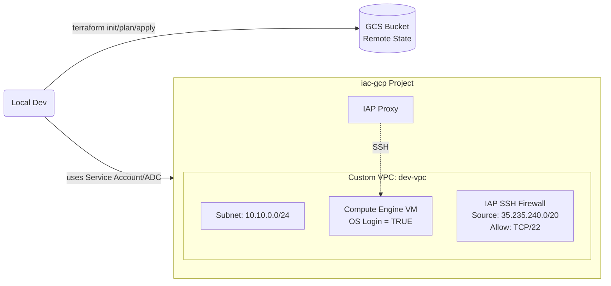

# Terraform GCP Starter — VPC + VM (Remote State on GCS)

A small yet production‑quality Infrastructure‑as‑Code project for **Google Cloud** using **Terraform**.  
It creates a **custom VPC, Subnet, Firewall (IAP SSH)** and a **Compute Engine VM** with **OS Login** enabled.  
State is stored remotely on **Google Cloud Storage (GCS)** with versioning.

---

## 🔧 Features
- Moduleized Terraform: `network` (VPC/Subnet/Firewall), `compute` (VM).
- **Remote state** backend on **GCS** (with object versioning).
- **OS Login** (IAM‑based SSH). Optional **public IP** for fast demo; recommended **IAP** for secure SSH.
- Clean environment folder (`envs/dev`) with variables/outputs.

---

## Project Architecture



**Notes**
- VPC uses **custom subnet mode** → VM must reference the **subnetwork self_link** (not just network).
- OS Login lets you manage SSH access via IAM; combine with **IAP** to avoid public IPs.

---

## Repository Structure

```
terraform-gcp-starter/
├─ README.md
├─ versions.tf          # pin Terraform & provider versions
├─ backend.tf           # remote state on GCS
├─ modules/
│  ├─ network/          # VPC, Subnet, Firewall (IAP SSH)
│  │   ├─ main.tf
│  │   └─ variables.tf
│  └─ compute/          # VM (OS Login), optional public IP
│      ├─ main.tf
│      └─ variables.tf
└─ envs/
   └─ dev/
       ├─ main.tf       # wires modules together
       ├─ variables.tf  # project/region/zone
       └─ terraform.tfvars
```

---

## Prerequisites
- **Terraform** ≥ 1.3 (`terraform version`)
- **Google Cloud SDK** (`gcloud --version`), authenticated and set to your project
- A **GCP Project** (e.g., `iac-gcp-XXXXXX`) with a **Service Account** and permissions:
  - `Compute Admin`, `Compute Network Admin`, `Storage Admin`
- A **GCS bucket** for remote state (created once):
  ```bash
  gcloud storage buckets create gs://tf-state-<project-id> --location=asia-southeast1
  gcloud storage buckets update gs://tf-state-<project-id> --versioning
  ```
- Local auth via **Application Default Credentials** (ADC). On Windows PowerShell:
  ```powershell
  setx GOOGLE_APPLICATION_CREDENTIALS "C:\path	o\your-service-account.json"
  # open a new terminal after setx
  gcloud config set project <project-id>
  ```

> Tip: For production, consider **Workload Identity Federation (WIF)** instead of long‑lived keys.

---

## ⚙️ Configuration (files summary)

### `versions.tf`
Pins Terraform and google provider versions.

### `backend.tf`
Remote state on a pre‑created GCS bucket:
```hcl
terraform {
  backend "gcs" {
    bucket = "tf-state-<project-id>"
    prefix = "envs/dev"
  }
}
```

### `envs/dev/variables.tf`
```hcl
variable "project_id" { type = string }
variable "region"     { type = string }
variable "zone"       { type = string }
```

### `envs/dev/terraform.tfvars`
```hcl
project_id = "<your-project-id>"
region     = "asia-southeast1"
zone       = "asia-southeast1-b"
```

### `modules/network`
- Creates **VPC** (custom mode), **Subnet**, **Firewall** for IAP SSH.
- Exposes outputs: `network_self_link`, `subnetwork_self_link`.

### `modules/compute`
- Creates **Compute Engine VM** with:
  - `metadata.enable-oslogin = TRUE`
  - optional public IP via `public_ip` variable
- Exposes outputs: `vm_internal_ip`, `vm_external_ip`.

### `envs/dev/main.tf` (wire‑up)
- Uses provider `google` taking project/region from variables.
- Calls `module.network` and `module.vm`.
- Has **outputs**: SSH hints for public/IAP.

---

## Quickstart (Dev environment)

> Run in **PowerShell** or your shell of choice. Replace placeholders.

```powershell
cd envs\dev

# Format & Initialize (uses GCS backend)
terraform fmt
terraform init

# Review plan
terraform plan

# Apply
terraform apply -auto-approve
```

### SSH to the VM
- **Public IP (fast demo)**: set `public_ip = true` in `envs/dev/main.tf`
  - Output will show the external IP. You can SSH via:
    ```powershell
    gcloud compute ssh dev-vm-1 --zone=asia-southeast1-b
    # or: ssh debian@<external-ip> (if you already manage keys/users)
    ```
- **Secure (recommended)**: set `public_ip = false` and use **IAP**:
  ```powershell
  gcloud compute ssh dev-vm-1 --zone=asia-southeast1-b --tunnel-through-iap
  ```

### Destroy when done
```powershell
terraform destroy -auto-approve
```

---

## Security & Best Practices
- Use **OS Login + IAP** to avoid public SSH exposure.
- Store state in **GCS** with **versioning** (rollback safety).
- Principle of **least privilege** for Service Accounts; avoid broad `Editor` in production.
- For CI, prefer **Workload Identity Federation** over JSON keys.

---

## Enhancements (Roadmap)
- **GitHub Actions** for `terraform fmt/validate/plan` on PR; `apply` on main (with WIF).
- **pre-commit** hooks: `terraform fmt`, `validate`, `tflint`.
- Add module(s) for **project APIs enablement**, **Cloud NAT/Router**, **private GCR/AR**, etc.
- Parameterize machine type, image, tags via variables or `.tfvars` per environment.